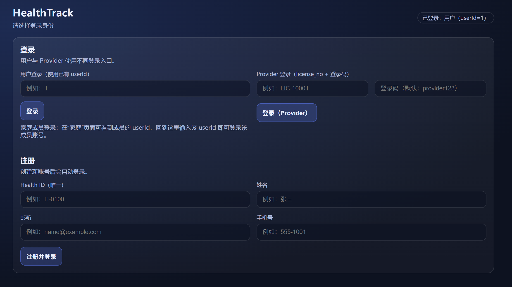
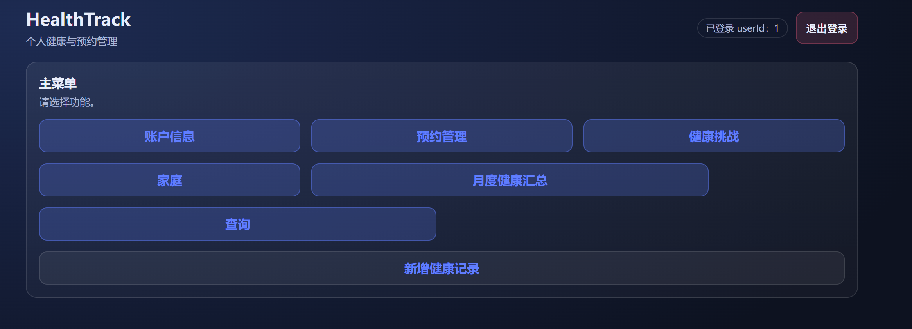
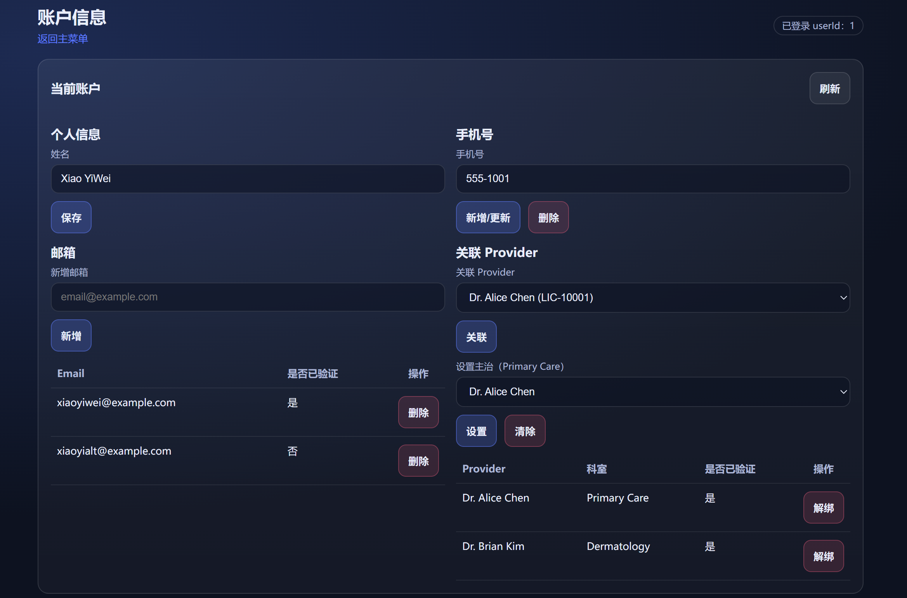
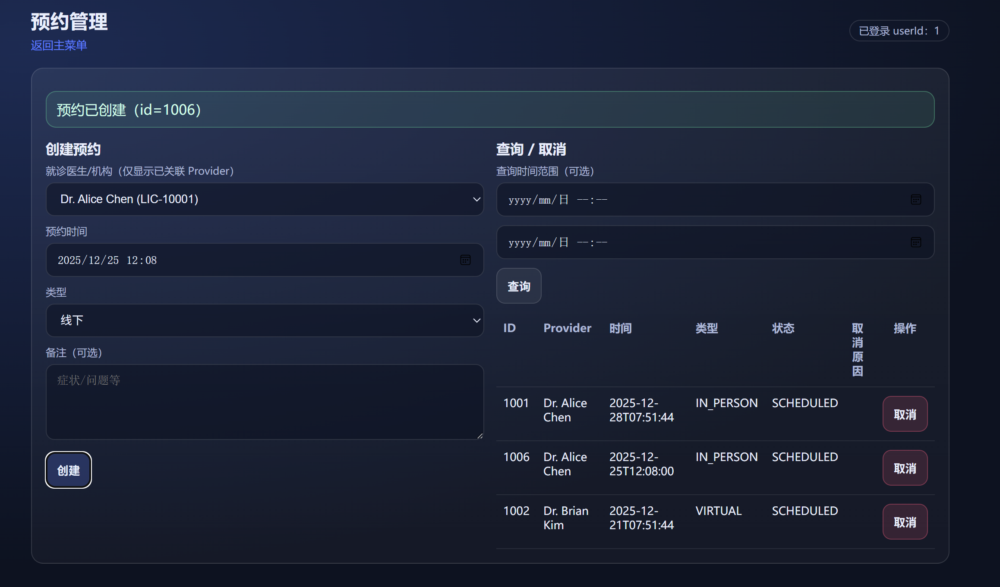
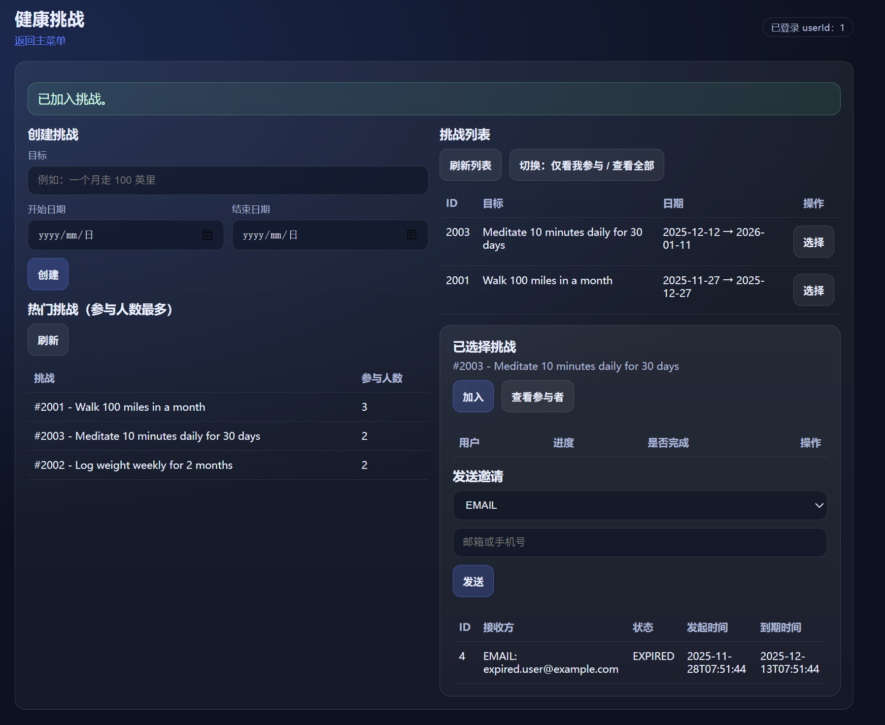
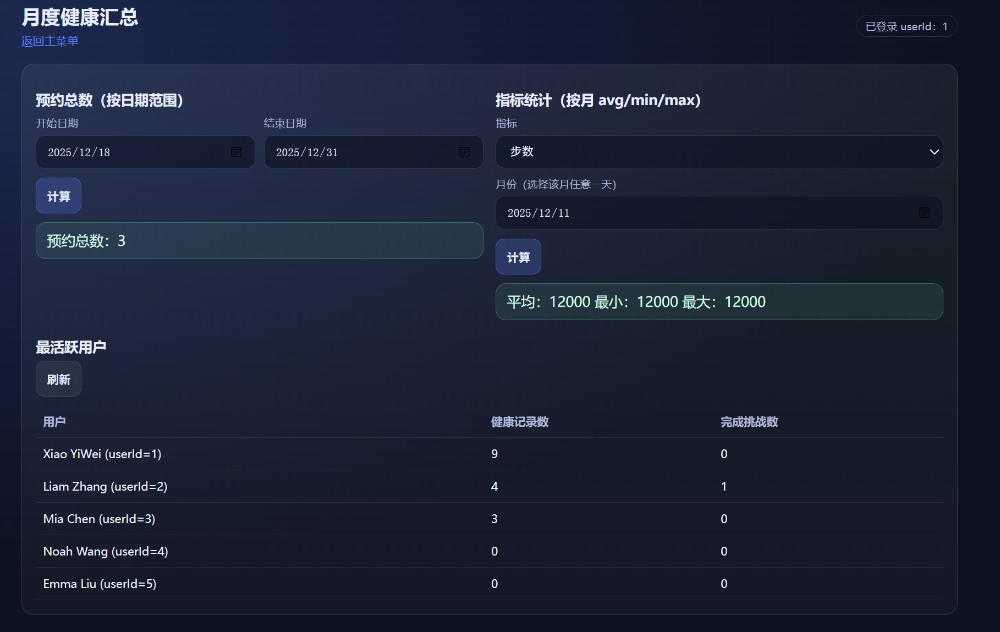
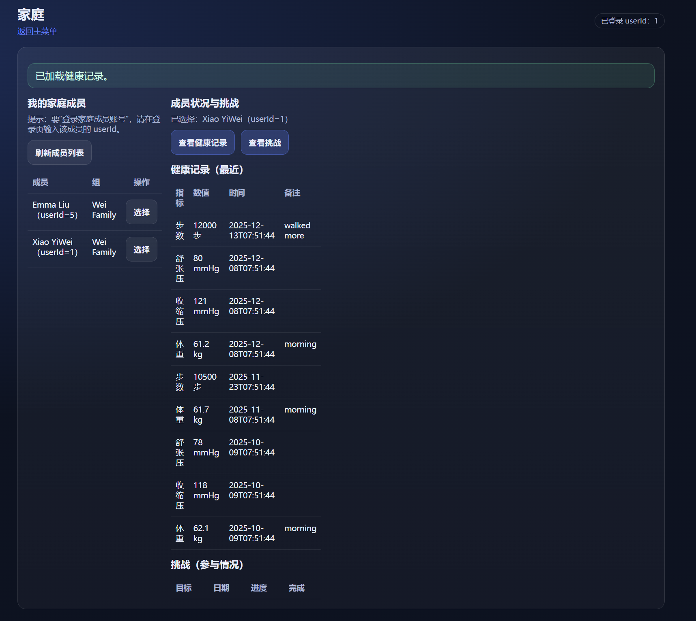
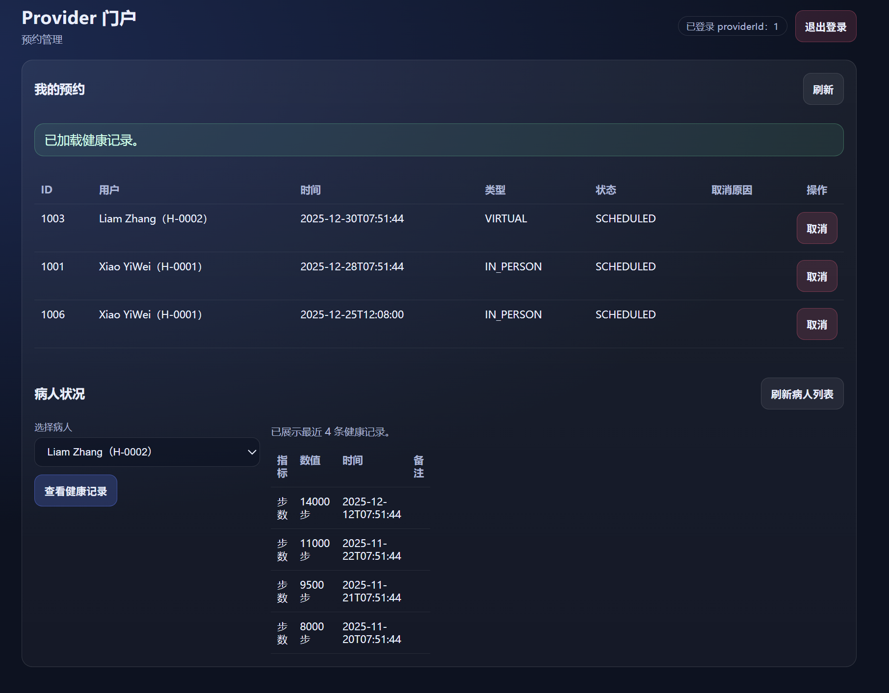

# 1. 阶段目标

本阶段的实现目标主要包括以下几个：
- 建立完整的 HealthTrack 数据库模式（PK/FK/唯一/索引齐全），可在 MySQL 8 上无错误执行。
- 造数生成数据库实例，数据量足以支撑演示与统计查询，无完整性冲突。
- 实现 GUI + REST API，覆盖主菜单要求（账户、预约、挑战、月度汇总、搜索、登出）以及 Provider 门户。
- 提供可运行的源代码、SQL 脚本、运行说明和演示截图。
- 在保证教学示例可读性的同时，尽量遵循工程化实践：分层（Controller/Service/Repo）、集中配置、脚本化部署、可重复造数。

# 2. 数据库模式与实例

数据库模式（Scheme 创建）
- 文件：`sql/01_schema.sql`
- 核心表与约束：
  - 账户与联系人：`user_account`（health_id 唯一，primary_provider_id 可空，FK→provider，ON DELETE SET NULL）、`user_email`（多邮箱，email 全局唯一）、`user_phone`（单手机号，phone 全局唯一，PK=user_id）。
  - Provider：`provider`（license_no/email 唯一，验证标记）、`provider_account`（PK/FK=provider_id）、`user_provider_link`（M:N 绑定，PK=(user_id, provider_id)，ON DELETE CASCADE/RESTRICT）。
  - 家庭：`family_group`、`family_group_member`（role/can_manage）。
  - 预约：`appointment`（ENUM 类型/状态，索引 user/provider+time）、`appointment_cancellation`（PK=appointment_id，存取消时间与原因）。
  - 挑战/邀请：`challenge`、`challenge_participant`（进度/完成状态，PK=(challenge_id,user_id)）、`invitation`（EMAIL/PHONE，唯一组合 (challenge_id, recipient_type, recipient_value)，recipient_user_id 可空）。
  - 健康指标：`metric_type`（code 唯一）、`health_record`（时间索引支撑统计）。
- 索引：health_record(user_id, recorded_at)、health_record(metric_type_id, recorded_at)、appointment(user_id/provider_id, scheduled_at) 等。
- FK 删除策略：多数 CASCADE；provider 与 appointment RESTRICT；primary_provider_id SET NULL。
- 设计取舍：主治医生用 nullable FK 简化约束；邀请、取消等扩展实体拆表，避免在主表存大量可空字段；索引优先满足查询路径（按用户/时间、按指标/时间）。

数据库实例（造数）
- 文件：`sql/02_seed.sql`
- 覆盖场景：
  - 多用户（含多邮箱/验证状态）、多 Provider（含 login_code）、绑定关系与主治设置。
  - 家庭组 ≥2，含角色/管理权限。
  - 预约：SCHEDULED/COMPLETED/CANCELLED，含取消原因。
  - 挑战：多参与者、进度/完成；邀请：PENDING/ACCEPTED/EXPIRED。
  - 健康记录：weight/bp/steps 等指标，跨月分布，支撑月度统计与“活跃用户”计算。
- 执行保证：`scripts/install.sh` 自动创建 DB/用户、运行 01/02 SQL；无 FK/完整性错误。
- 造数意图：提供可视化演示所需的“对照场景”，例如已取消预约（展示取消原因）、过期与接受的邀请、跨月的健康记录以便统计，家庭成员共享/拒绝的权限校验等。

# 3. 应用程序

- 后端：`backend/`，Spring Boot 3 + JDBC（`JdbcTemplate`）；路由在 `controller/`，业务规则在 `service/`（24h 取消、权限、邀请类型、主治需先绑定），SQL 在 `repo/`。配置可用 `application.properties` 或 `scripts/.env.local`。
- 前端：`frontend/` 静态 HTML/CSS/JS；主菜单 `index.html`，功能页在 `frontend/pages/`，Provider 门户 `provider.html`；`assets/api.js` 调用后端 API。
- 脚本：`scripts/install.sh`（安装依赖、建库造数、生成 env）、`scripts/start.sh`（启动后端，可选 `--frontend` 起静态前端）。
- 设计原则：后端坚持“瘦 Controller、业务逻辑在 Service、SQL 在 Repo”以便测试和维护；前端保持静态文件、通过 fetch 调用 API，便于部署在任意静态服务器；脚本化减少人工配置差异。

# 4. 功能实现对照

- Account Info：改名；增删邮箱；增删/更新手机；绑定/解绑 Provider；设置/清除主治。  
  页面 `pages/account.html`，API `/api/account/*`
- Book an Appointment：创建预约（IN_PERSON/VIRTUAL）；用户取消需 ≥24h；搜索预约（health_id/provider/type/date）。  
  页面 `pages/appointment.html`，API `/api/appointment/*`
- Create a Wellness Challenge：创建/加入；更新进度/标记完成；查看参与者；邀请 EMAIL/PHONE；查看邀请；Top 挑战。  
  页面 `pages/challenge.html`，API `/api/challenge/*`
- Monthly Health Summary：预约计数；指标月度 avg/min/max；最活跃用户；Top 挑战。  
  页面 `pages/summary.html`，API `/api/summary/*` + `/api/challenge/top`
- Search Records：健康记录搜索（health_id/metric/date）；预约搜索同上。  
  页面 `pages/search.html`，API `/api/search/health-records`、`/api/appointment/search`
- Sign Out：前端清理当前 userId（localStorage）。
- Provider 门户（额外）：登录；查看/取消自己的预约（无 24h 限制）；患者列表；查看患者健康记录（仅限绑定患者）。  
  页面 `provider.html`，API `/api/provider/*`

# 5. 规格修订与假设

- 主治唯一性：由 M:N 条件唯一改为 `user_account.primary_provider_id` nullable FK，应用层校验已绑定。
- 邀请模型：实体化 `invitation`，支持 EMAIL/PHONE + 15 天过期，唯一组合防重复。
- 取消信息：拆表 `appointment_cancellation` 1:1 记录取消时间/原因，避免预约表空字段。
- 健康指标与记录：加入时间索引，支撑统计与搜索性能。
- 其他假设：health_id/邮箱/手机号全局唯一；活跃用户定义为健康记录数 + 完成挑战数；验证流程（验证码/双因素）不在范围内，但保留 is_verified 字段以便扩展。

# 6. 问题与解决方案

- **条件唯一（主治）**：MySQL 难以在 M:N 上做“仅一条主治”，采用 nullable FK + 绑定校验。
- **24h 取消规则**：无法用约束表达，放在 `AppointmentService.cancel` 比较 `scheduled_at - 24h` 与当前时间；Provider 端不受限。
- **权限**：家庭/Provider 视图在 Service 层校验成员/患者关系，不满足返回 400。
- **性能**：为记录/预约添加时间索引；查询使用日期范围与 LIMIT。
- **重复邀请/唯一冲突**：通过唯一键和错误处理（409）防止重复 email/phone/invitation。
- **部署与权限（容器环境）**：install/start 脚本兼容无 sudo 的容器；若 MySQL 未自动启动，脚本提示手动 `service mysql start`。

# 7. 功能图片展示与示例操作

> 截图请放入 `docs/assets/`，并替换下列占位文件名。

## 7.1 登录与主菜单
- 在 `login.html` 输入 `userId=1` 登录，跳转主菜单 `index.html`。

## 7.2 账户信息（Account Info）
- 修改姓名；新增邮箱；更新手机号；绑定 Provider 并设置主治。

## 7.3 预约（Appointment）
- 创建预约；随后取消并填写原因（满足 ≥24h 规则）；在列表中查看状态和原因。

## 7.4 健康挑战（Challenge）
- 创建挑战；加入并更新进度；标记完成；发送邀请。

## 7.5 统计与搜索（Summary / Search）
- 查看月度信息；查看 Top Active Users

## 7.6 家庭视图
- 查看家庭成员的健康记录/挑战。

## 7.7 Provider 门户
- 查看预约列表；查看患者健康记录。

# 8. 运行与部署
- 环境依赖：MySQL 8.x、Java 17、Maven 3.8+、现代浏览器。
- 一键脚本：`./scripts/install.sh`（安装依赖、启动 MySQL、建库造数、生成 `.env.local`、预热依赖）；`./scripts/start.sh --frontend`（启动后端 + 静态前端服务，默认端口 4173）。
- 手动方式：执行 `sql/01_schema.sql`、`sql/02_seed.sql`；配置 `backend/src/main/resources/application.properties` 或 `.env.local`；`mvn spring-boot:run`；打开 `frontend/login.html`。
- 默认端口：后端 8080；前端静态服 4173（可通过脚本参数或环境变量覆盖）。
- 登录账号：用户 `userId=1..6`；Provider `license_no=LIC-10001..10004`，登录码 `provider123`。
- 部署注意：前端为纯静态资源，可用任意静态服务器；后端需要 JDBC 连接参数正确，建议通过 `.env.local` 做环境区分。

# 9. 测试与验证
- 造数覆盖：预约多状态、挑战/邀请多状态、跨月健康记录、家庭组权限等，可直接用于回归演示。
- 接口验证：`docs/Detail/curl_samples.sh` 提供核心流程的 curl 示例；前端页面覆盖全部 API。
- 约束校验：唯一键（health_id / email / phone / license_no / metric_code / invitation 组合）由数据库强制；业务层补充 24h 取消规则、邀请类型校验、权限校验（家庭/Provider）。
- 统计验证：Summary 与 Challenge 模块可直接查看月度指标、预约计数、活跃用户、Top 挑战，数据来自 seed 的跨月记录。
- 回归建议：每次修改 SQL 或 Service 逻辑后，可重新运行 `sql/02_seed.sql` 以重置数据，保证演示可重复。

# 10. 健壮性、性能与安全
- 数据完整性：PK/FK/唯一约束覆盖核心关系；删除策略谨慎（多数级联，关键实体限制删除或置空）。
- 性能：为健康记录与预约添加时间索引；查询使用过滤条件与 LIMIT；造数体量足以验证统计但可快速执行。
- 输入校验：Jakarta Validation 处理必填/格式；业务规则校验预约类型、时间窗口、权限等。
- 错误处理与跨域：`ApiExceptionHandler` 统一 4xx/5xx；`CorsConfig` 放开跨域便于前端调用。
- 安全待提升：当前为教学示例，登录简化；可后续引入 JWT/OAuth、多因素认证、审计与限流。
- 可扩展性：采用分层结构与 DTO 结构化响应，便于新增新菜单/统计口径并保持向后兼容。

# 11. 残留风险与未来改进
- 身份与权限：正式认证/授权体系，审计日志，多角色粒度权限。
- 数据与模型：软删除/历史版本，指标单位管理，更严格的重复检测与校验。
- 可观测性与性能：APM/metrics、结构化日志、分页与缓存、索引调优。
- 业务增强：邀请接受/注册流程，邮件/短信通知，预约提醒，更丰富的统计报表与图表化。
- 前端体验：更完善的表单校验、状态提示、加载与错误态设计；组件化与可访问性改进。

# 12. 文档与提交材料
- 需求/规范：`docs/Requirement/project_deliverable_*.md`、`docs/Requirement/project_description.md`
- 设计与演示：`docs/code_overview.md`、`docs/feature_manual_detailed.md`、`docs/demo_playbook.md`
- 运行与提交辅助（Detail）：`docs/Detail/api_reference.md`、`docs/Detail/db_schema_detail.md`、`docs/Detail/seed_data_overview.md`、`docs/Detail/run_and_troubleshoot.md`、`docs/Detail/screenshots_guide.md`、`docs/Detail/curl_samples.sh`
- 截图资源：请放置在 `docs/assets/`，对应本报告中的占位文件名。
- 若需提交清单与核对，可参考 `docs/README.md` 中的目录说明。
